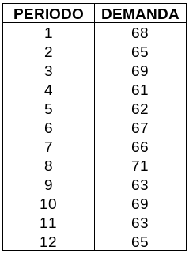
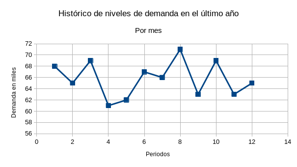
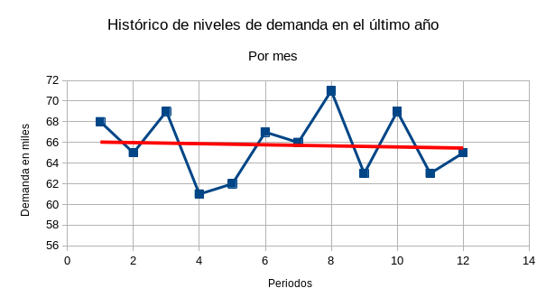

## Introducción.

Para una empresa es muy importante mantener satisfechos a sus clientes, con lo que se puede conseguir que estos vuelvan a comprar sus productos o adquirir sus servicios. Pero en ocasiones resulta difícil saber con exactitud si dichos clientes se encuentran satisfechos. Para ello se manejan los indicadores de satisfacción al cliente, rubro que está incluido en la norma ISO 9001. Se manejan dos tipos de obtención de información al respecto: directa e indirecta. La primera va sobre preguntarle al cliente mediante encuestas o llamadas sobre su sentir. La segunda implica recabar datos sobre rechazos, reclamaciones, quejas, cumplimiento de tratos y contratos, tiempos de entrega, etcétera.

En ocasiones es difícil cumplir con los plazos y cantidades a entregar, debido a que los procesos de producción no son tan rápidos como nos gustaría. En esos casos, lo que se hace es utilizar técnicas de pronóstico para adelantarse a los futuros pedidos, fabricando un estimado de lo que necesitemos. Para utilizar dichas técnicas es muy importante contar con datos históricos de las ventas o la demanda. Abordaremos tres técnicas de pronóstico bastante comunes: los promedios móviles, el suavizamiento exponencial y la regresión lineal.

## Indicadores Clave del Rendimiento

A continuación podemos enlistar los indicadores clave de rendimiento, los cuales son los siguientes:

### Indicador NPS (Net Promoter Score)

Es una medida de cuántos clientes se encuentran tan satisfechos con la empresa que la recomendarían o promoverían a otras personas. La puntuación es positiva si existen más personas que la recomiendan que las que no. Es neutra si la cantidad de detractores iguala a los promotores y requiere trabajo. Por el contrario, si hay más detractores, entonces tenemos un balance negativo.

### Puntuación de esfuerzo del cliente

Con este índice pretendemos conocer qué tan fácil es resolver un problema específico por parte del cliente. Recordemos que es más fácil que un cliente vuelva a adquirir un servicio o producto si no necesita realizar un gran esfuerzo para hacerlo. Mientras más fácil sea, más posibilidad de fidelizar al cliente. Aquí podemos englobar también el tiempo que un cliente espera para ser atendido o para recibir su producto.

### Clientes muy satisfechos

Los clientes muy satisfechos son clientes fidelizados, es decir, promotores de la empresa. No podemos descuidarlos ni dejar a un lado la importancia que tienen en cuanto a la información que puedan darnos. Es excelente idea preguntarles qué es lo que los tiene extremadamente contentos con nuestro producto o servicio y utilizar ello para aplicarlo a la clientela restante.

### Satisfacción general

Debemos tomar en cuenta que alcanzar un nivel de satisfacción del 100% es casi imposible o cuando menos, poco realista. Pero lo que sí es posible es trabajar para cada vez acercarnos más a un nivel de satisfacción elevado. Por ello es necesario saber cuántos clientes satisfechos tenemos y lo que causa que lo estén, para así aumentar el nivel y no quedarnos estancados. Esto se consigue con información en principio, conociendo las áreas con problemas y las oportunidades de mejora. Lo anterior se puede conocer mediante las reclamaciones hechas por los clientes, las cuales ofrecen una de las mejores fuentes de información sobre lo que debe mejorarse.

### Puntos de referencia externos

Ya cumpliendo con el autoconocimiento, ya podemos enfocarnos en no perder de vista a los competidores y ubicar exactamente nuestra empresa en el escenario global. Aquí podemos establecer comparaciones en cuanto a los tiempos de entrega, tiempo en resolver quejas o reclamaciones e incluso los plazos de envío. Recordemos que si un competidor puede ofrecer el mismo servicio en menos tiempo, es muy posible que perdamos al cliente ante él.

### Atributos de marca

¿Qué es lo que los clientes esperan de la empresa o de sus productos y servicios? Si lo que nosotros visualizamos de nuestra empresa es un producto único o con suficiente personalidad y nuestros clientes no, entonces necesitamos trabajar en ello. Es necesario que nuestros clientes nos vean como nosotros queremos ser vistos. Esto ya es parte de la imagen de la empresa como tal.

## Técnicas de pronóstico

Utilizaremos tres técnicas que resultan ser bastante comunes: los promedios móviles, el suavizamiento exponencial y el análisis de regresión; siendo las primeras dos conocidas como _métodos de suavizamiento_ y la tercera conocida también como _análisis de tendencia__.

### Métodos de suavizamiento

Aquí englobaremos dos métodos: los promedios móviles y el suavizamiento exponencial. La mejor recomendación para usarlos es que se aplican cuando los datos históricos tienen un comportamiento aparentemente caótico o aleatorio. No existe algún patrón visible o alguna tendencia, es decir, no es visible un cambio sostenido (ya sea crecimiento o disminución). Ahondaremos más en ello en sus respectivas secciones.

#### Ejemplo

Supongamos que estamos teniendo problemas para cumplir con los periodos de entrega de cierto producto, debido a que el departamento de ventas no puede entregar una estimación de la demanda al departamento de producción. Esto imposibilita al último departamento el tratar de anticiparse a dichos niveles de producción. Es necesario obtener un pronóstico, a partir de datos históricos que permitan comprender el comportamiento de la demanda. Utilizaremos para ello el histórico de la demanda mensual durante el último año:

La primera recomendación pasa por graficar dichos datos, de preferencia con algún programa de hoja de cálculo como Excel. Esto es para visualizar su comportamiento y comprobar si existe algún patrón o no. La gráfica resultante (del tipo gráfico XY o de dispersión, con puntos y líneas) se muestra a continuación:

Podemos notar que no existe un crecimiento como tal, más bien, hay un conjunto de subidas y bajadas. Por ejemplo, si tuviéramos que trazar una línea que vaya por enmedio de todos los puntos, sería una línea casi horizontal. Esta es la mejor prueba de que no existe una tendencia a la alza (o a la baja). Resulta muy sencillo agregar una línea así, si es que estamos trabajando con una aplicación de computadora. Simplemente damos clic derecho a cualquiera de los puntos y en el menú que parece, seleccionamos «Agregar línea de tendencia». Si lo hicimos de manera correcta, aparecerá algo más o menos como sigue:

Con esto, nos aseguramos de poder utilizar algún método de suavizamiento. El procedimiento se muestra en el video a continuación:

También puede utilizarse el suavizamiento exponencial con estos datos. A continuación un video que muestra este método:

La manera de decidir cuál de los dos es mejor es mediante el Cuadrado Medio del Error. Mientras más bajo sea este, mejor pronóstico dará el método al que corresponda. El video que sigue muestra cómo se calcula dicho dato:

